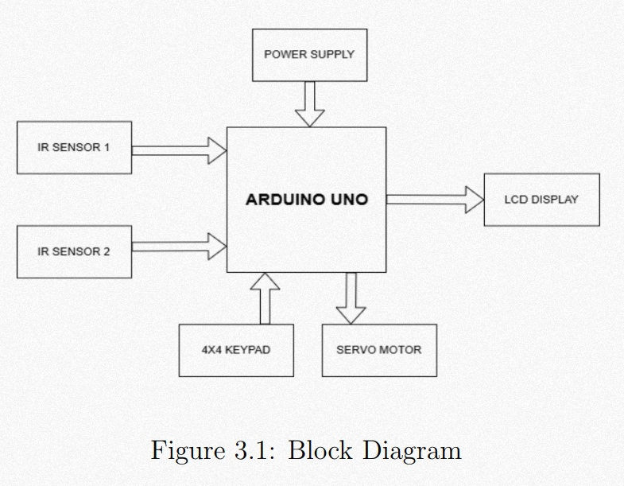

# Secure Visitor Counter with Crowd Control


> An automated visitor monitoring and crowd control system using IR sensors, servo motor, 16x2 LCD and a 4x4 keypad — built on Arduino Uno. The system restricts entry once maximum occupancy is reached and allows access only through registration number verification.

---

## 📌 Table of Contents
- [How It Works](#-how-it-works)
- [Circuit](#-circuit)
- [Hardware Implementation](#-hardware-implementation)
- [PCB Design](#-pcb-design)
- [Components](#-components)
- [Libraries Used](#-libraries-used)
- [Source Code](#-source-code)
- [Results](#-results)

---

## ⚙️ How It Works

The system uses two IR sensors — one at the entry and one at the exit — to detect movement and maintain an accurate real-time visitor count. The Arduino Uno processes all sensor signals, manages the door mechanism, and enforces the maximum occupancy limit.

![Block Diagram]

**Step-by-step flow:**

**1. System Initialization** — On power-up, the Arduino initializes all peripherals. The LCD displays `Visitor Counter | Count: 0/4` and the servo motor holds the door in the closed position.

**2. Entry Detection** — When the IR entry sensor detects a person (output goes LOW), the system checks if the current count is below the maximum limit (4). If within limit, it prompts `Enter Reg. Number` on the LCD.

**3. Registration Verification** — The user enters a 4-digit number via the 4x4 keypad. The Arduino compares this against a stored list of valid registration numbers. If valid, the count increments and the door opens. If invalid, `Invalid Number` is shown and entry is denied.

**4. Door Control** — On successful verification, the servo motor rotates to 90° (door open), holds for 3 seconds, then returns to 0° (door closed). A `doorMoving` flag prevents any new sensor triggers during this operation.

**5. Exit Detection** — When the IR exit sensor detects a person leaving, the count decrements automatically. No verification is needed for exit. A debounce delay of 1000ms prevents false triggers.

**6. Crowd Control Enforcement** — If `visitor_count == maxVisitors`, the system sets `maxCountReached = true` and displays `Max Count Reached | Entry Prohibited`. The door will not open for new entries until the count drops below the limit.

**7. Continuous Monitoring** — The main loop continuously polls both sensors in real time, handling all entry and exit events without any manual intervention.

---

## 🔌 Circuit

The Arduino Uno is the central controller. Both IR sensors connect to digital input pins D2 and D3. The servo motor PWM signal goes to D9. The LCD communicates over I2C using A4 (SDA) and A5 (SCL), which reduces wiring to just 4 wires. The 4x4 keypad uses 8 digital pins — rows on D12, D11, D10, D8 and columns on D4, D5, D6, D7.


| Component | Arduino Pin |
|---|---|
| IR Entry Sensor (OUT) | D2 |
| IR Exit Sensor (OUT) | D3 |
| Servo Motor (Signal) | D9 |
| LCD SDA | A4 |
| LCD SCL | A5 |
| Keypad Rows | D12, D11, D10, D8 |
| Keypad Columns | D4, D5, D6, D7 |

---

## 🛠️ Hardware Implementation

The system was physically assembled and tested using a cardboard door model named "Mondini Hall." The LCD and keypad were mounted on the front panel for user interaction. The Arduino, servo, and IR sensors were wired behind the frame. The servo arm was mechanically linked to a door flap to simulate real door open/close operation.


---

## 📐 PCB Design

The schematic and PCB were designed in KiCad to convert the breadboard prototype into a production-ready layout. The schematic captures all component connections and net assignments. The PCB consolidates these into a compact single-layer board with clearly labeled pads for each peripheral.


The 3D view confirms component placement and checks for mechanical clearance before fabrication.


---

## 🧰 Components

| # | Component | Qty | Cost |
|---|---|---|---|
| 1 | Arduino Uno (ATmega328P) | 1 | ₹230 |
| 2 | 16x2 LCD Display with I2C module | 1 | ₹150 |
| 3 | IR Obstacle Sensor (2–30cm range) | 2 | ₹80 |
| 4 | Micro Servo Motor SG90 | 1 | ₹40 |
| 5 | 4x4 Matrix Membrane Keypad | 1 | ₹100 |
| | **Total** | | **₹600** |

---

## 📚 Libraries Used

| Library | Purpose |
|---|---|
| `LiquidCrystal_I2C` | Controls the 16x2 LCD over I2C protocol. Uses only 2 wires (SDA, SCL) instead of the standard 6–8 pin parallel interface, simplifying wiring significantly. |
| `Wire` | Provides I2C communication support for Arduino. Required as a dependency by `LiquidCrystal_I2C` to handle the low-level data transmission between Arduino and the LCD module. |
| `Servo` | Manages PWM signal generation for the SG90 servo motor. Allows precise angle control (0°–180°) using simple `servo.write(angle)` commands without manually handling PWM timing. |
| `Keypad` | Handles 4x4 matrix keypad scanning using row-column multiplexing. Detects key presses by sequentially pulling rows low and reading column states, reducing 16 buttons to just 8 pins. |

**Install via Arduino IDE:**
`Sketch → Include Library → Manage Libraries → Search each library name`

---

## 💻 Source Code

| File | Description |
|---|---|
| [`01_src/03_a.cpp`](01_src/03_a.cpp) | Main Arduino source code — full system logic |
| [`02_Visitor_simulation/sketch.ino`](02_Visitor_simulation/sketch.ino) | Wokwi online simulation sketch |
| [`02_Visitor_simulation/diagram.json`](02_Visitor_simulation/diagram.json) | Wokwi circuit wiring diagram |
| [`02_Visitor_simulation/libraries.txt`](02_Visitor_simulation/libraries.txt) | Library dependencies for simulation |
| [`03_PCB/Schematic.kicad_sch`](03_PCB/Schematic.kicad_sch) | KiCad schematic source file |
| [`03_PCB/PCB_design.kicad_pcb`](03_PCB/PCB_design.kicad_pcb) | KiCad PCB layout source file |
| [`03_PCB/Visitor_Counter.kicad_pro`](03_PCB/Visitor_Counter.kicad_pro) | KiCad project file |

**Default valid registration numbers:**
```
1238 | 5678 | 9101 | 1121
```
> To modify, update the `validRegistrationNumbers[]` array in [`01_src/03_a.cpp`](01_src/03_a.cpp)

---

## 📊 Results

The system was tested across multiple scenarios and performed accurately in all cases.

When the system powers on, the LCD initializes with `Visitor Counter | Count: 0/4`. Upon entry detection, the system successfully prompts for a registration number. Entering a valid number increments the count, opens the servo door for 3 seconds, and updates the display. An invalid number shows `Invalid Number` for 2 seconds before returning to idle.

The exit sensor correctly decrements the count each time a person leaves, and the `maxCountReached` flag resets automatically, re-enabling entry. When all 4 slots are occupied, the LCD switches to `Max Count Reached | Entry Prohibited` and the door remains locked regardless of sensor triggers.

The debounce mechanism successfully prevented false triggers on both entry and exit sensors during rapid movement testing.

| Test Case | Input | Result |
|---|---|---|
| Power ON | — | `Visitor Counter / Count: 0/4` ✅ |
| Valid entry | Reg. No: 1238 | Count increments, door opens ✅ |
| Invalid entry | Reg. No: 0000 | `Invalid Number` shown ✅ |
| Max capacity | Count = 4 | `Max Count Reached / Entry Prohibited` ✅ |
| Exit detected | IR Exit triggered | Count decrements, entry re-enabled ✅ |
| Incomplete input | Less than 4 digits + # | `Enter 4 digits!` shown ✅ |

---

## 📜 License

This project is licensed under the [MIT License](LICENSE).
